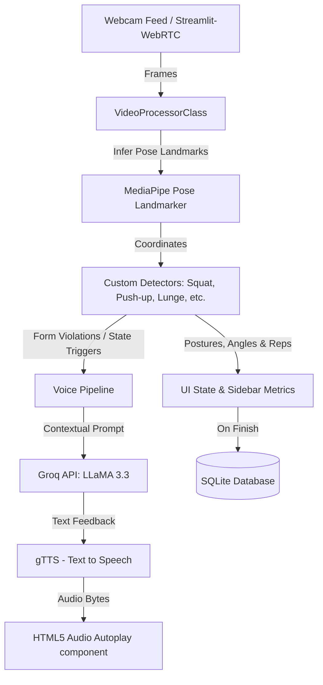

# 🏋️‍♂️ Apna AI Coach — Real-Time AI Gym Trainer & Form Coach

Apna AI Coach is an interactive, real-time web application that uses your webcam to monitor your workout form and provide instant audio feedback. Built with **Streamlit**, **MediaPipe**, **Streamlit-WebRTC**, and **Groq (LLaMA 3.3)**, it acts as a personal trainer in your browser, analyzing your posture, counting reps, and speaking to you with proactive, energy-filled coaching cues when your form slips.

---

## ✨ Features

- 📹 **Real-Time Video Analytics:** High-performance, low-latency video streaming directly from the web browser utilizing WebRTC.
- 🦴 **Pose Estimation & Overlay:** Live skeletal landmarks mapped directly onto your video using the Google MediaPipe Pose Landmarker model.
- 📐 **Custom Exercise Rules Engine:** Specialized math engines analyzing joint angles and posture for five major exercises:
  - **Squats:** Tracks knee and back angles to detect squat depth (e.g., *too high*) and torso lean.
  - **Push-ups:** Tracks elbow angles and full-body alignment to catch sagging hips or piked form.
  - **Biceps Curls (Dumbbell):** Monitors elbow angles, swinging torsos, and shoulder stability.
  - **Shoulder Press:** Checks arm extension consistency and detects excessive back arching.
  - **Lunges:** Evaluates front knee flexion, torso angles, and balance control.
- 🤖 **Proactive AI Voice Coaching:** Integrated with a **Groq-powered LLM** (`llama-3.3-70b-versatile`) and Google Text-to-Speech (**gTTS**). The coach speaks energetic, context-aware cues (e.g., *"Keep your back straight!"* or *"Great job, final rep!"*) based on your live performance.
- 📊 **Workout History & SQL Persistence:** Automatically saves finished workouts (exercise, sets, reps, duration) in a local SQLite database, showing summary analytics and progress tables directly in the UI.
- 🎨 **Premium Styling:** Sleek, glassmorphic UI elements styled with custom CSS and typography (`AdobeClean` font).

---

## 🏗️ Architecture Flow



---

## 📂 Project Structure

```text
├── .streamlit/             # Streamlit theme configuration
├── core/                   # Core tracking utilities
├── detectors/              # Mathematical rules and angle detectors for exercises
│   ├── biceps_curl.py      # Biceps curl angle and form analyzer
│   ├── lunges.py           # Lunges angle and balance analyzer
│   ├── pushup.py           # Push-up angle and alignment analyzer
│   ├── shoulder_press.py   # Shoulder press extension and arch analyzer
│   └── squat.py            # Squat depth and back leaning analyzer
├── ml_models/              # MediaPipe Pose Landmarker task binaries
├── services/               # Application service layers
│   ├── auth/               # Login walls and user session handlers
│   ├── coaching/           # Groq LLM prompting and gTTS voice pipelines
│   ├── config/             # Workspace prompt definitions and configurations
│   ├── persistence/        # SQLite DB connectors and database setups
│   ├── tracking/           # Local state metrics synchronization
│   ├── ui/                 # Custom CSS stylesheet and font loaders
│   └── vision/             # WebRTC frame receiver and skeletal drawing overlay
├── static/                 # Custom CSS and local font assets
├── main.py                 # Core Streamlit app entrance
├── requirements.txt        # Python packages
└── .env                    # Environment credentials (API keys)
```

---

## 🚀 Getting Started

### 📋 Prerequisites

- **Python 3.10 or higher**
- A **Groq API Key** (You can sign up and get one for free at [console.groq.com](https://console.groq.com/))
- A webcam

### 🛠️ Installation & Setup

1. **Clone the Repository:**
   ```bash
   git clone https://github.com/your-username/AI-Gym-Coach.git
   cd AI-Gym-Coach
   ```

2. **Create a Virtual Environment:**
   ```bash
   python -m venv .venv
   # Activate on Windows:
   .venv\Scripts\activate
   # Activate on macOS/Linux:
   source .venv/bin/activate
   ```

3. **Install Dependencies:**
   ```bash
   pip install -r requirements.txt
   ```

4. **Set Up Environment Variables:**
   Create a `.env` file in the root directory:
   ```env
   GROQ_API_KEY=your_groq_api_key_here
   ```

5. **Download the MediaPipe Pose Landmarker Model:**
   Download the full pose landmark model file (`pose_landmarker_full.task`) from the [Google MediaPipe Model Zoo](https://storage.googleapis.com/mediapipe-models/pose_landmarker/pose_landmarker_full/float16/latest/pose_landmarker_full.task) and save it inside the `ml_models/` directory:
   ```text
   ml_models/pose_landmarker_full.task
   ```

---

## 🏃‍♂️ Running the Application

Launch the Streamlit app by executing:

```bash
streamlit run main.py
```

Open `http://localhost:8501` in your browser. Log in, define your workout plan (exercise, target sets, and reps) in the sidebar, and press **Start Workout** to enable your webcam and start training!

---

## 🛠️ Built With

- **[Streamlit](https://streamlit.io/)** — Main web app interface.
- **[Streamlit-WebRTC](https://github.com/whitphx/streamlit-webrtc)** — Browser video frame ingestion.
- **[MediaPipe](https://google.github.io/mediapipe/)** — Machine learning pipeline for human pose tracking.
- **[Groq Cloud API](https://groq.com/)** — Ultra-fast inference on `llama-3.3-70b-versatile` for immediate feedback.
- **[gTTS](https://github.com/pndurette/gTTS)** — Google Text-to-Speech library.
- **[SQLite](https://www.sqlite.org/)** — Embedded database for local workout data persistence.

---

## 🤝 Contributing

Contributions, issues, and feature requests are welcome! Feel free to open a pull request or submit an issue in the issue tracker.

## 📄 License

This project is licensed under the [MIT License](LICENSE).
